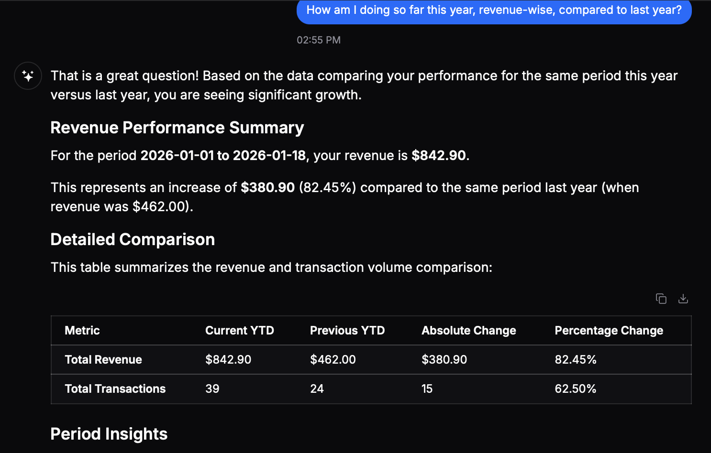
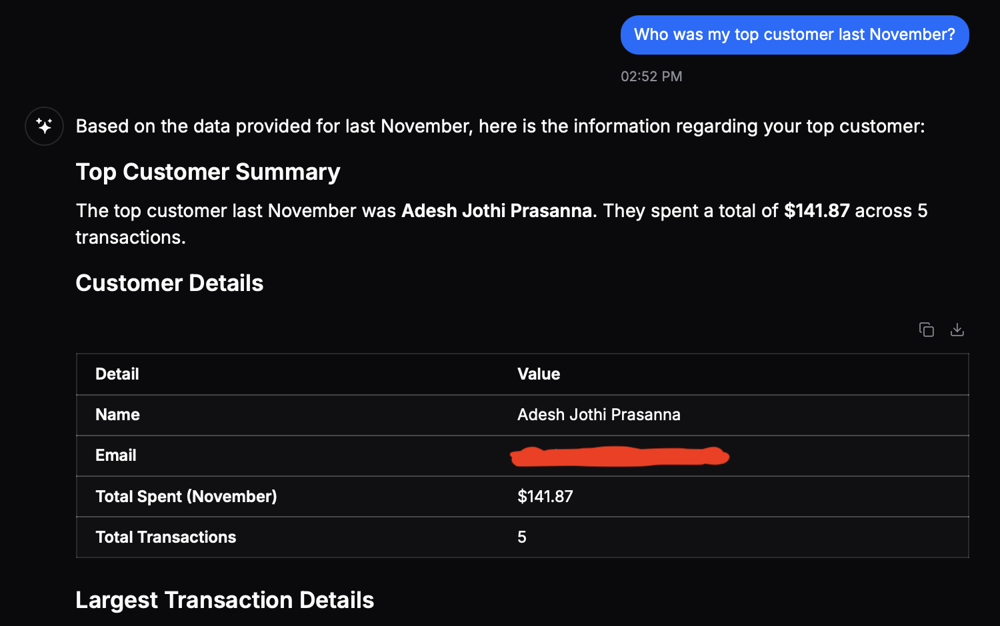
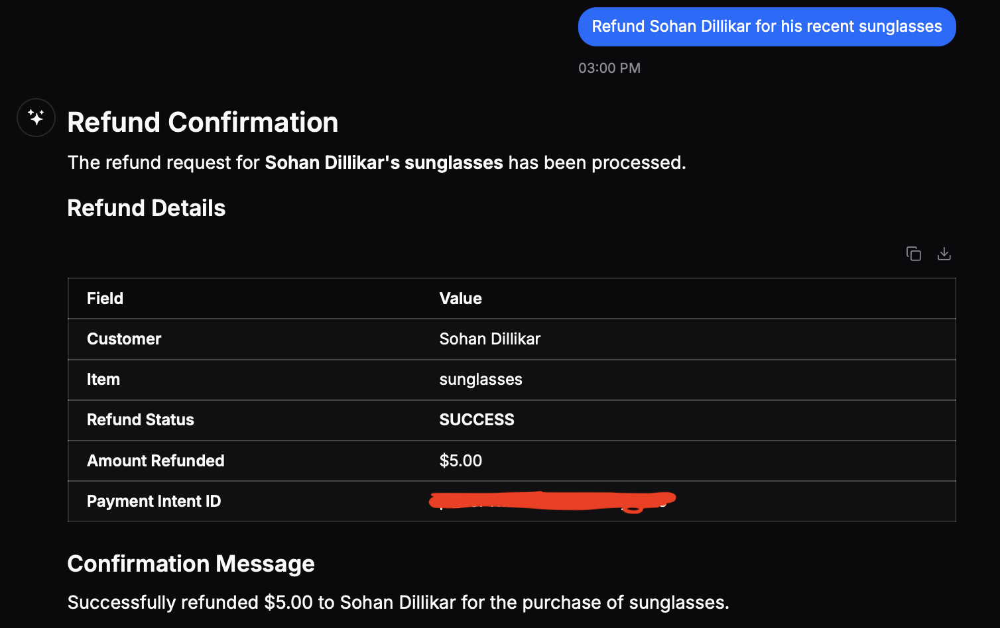

# Cashflow

A Stripe integrated finance agent built on Daemo's engine.

## Features

- **Revenue Analytics** - Analyze revenue trends over custom time periods
- **Refund Processing** - Issue full or partial refunds for payments
- **Payment History** - Retrieve detailed payment records including customer information, purchased items, and shipping details

## Screenshots







## Setup

1. Install dependencies:

```bash
npm install
```

2. Copy `.env.example` to `.env` and fill in your environment variables:

```bash
cp .env.example .env
```

3. Run the application:

```bash
npm start
```

For development with auto-reload:

```bash
npm run dev
```

The server will start on `http://localhost:3000` (or the port specified in your `.env` file).